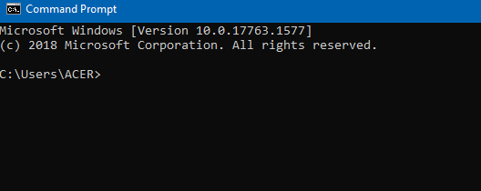
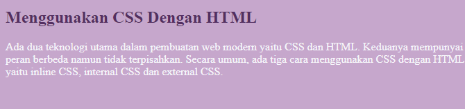
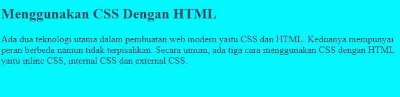
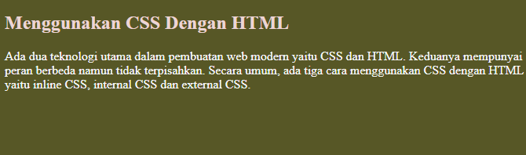

# Writing & Presentation Test Week-1

# Day 1 | Unix Command Line

## Pengenalan CLI dan Terminal

### Apa itu Command Line Interface) CLI ?
- Saat menyebut "command line" atau "command line interface", sebenarnya yang dimaksud adalah shell yang berbasis teks.

### Apa itu Shell?
- Shell adalah program yang menerima perintah, kemudian meneruskan perintah tersebut ke system untuk dieksekusi.  

### Contoh CLI
- sh
- bash
- zsh
- cmd.exe

### Terminal Emulator
- Merupakan aplikasi untuk mengakses CLI, Saat pertama kali membuka terminal, kamu akan dihadapkan dengan tampilan seperti ini. 

    

    Ini disebut "shell prompt" dan tampilan ini muncul ketika shell siap menerima input.

## Navigasi menggunakan CLI

- ```pwd``` digunakan untuk melihat nama direktori kita berada saat ini
- ```ls``` digunakan untuk melihat isi dari direktori
- ```cd``` digunakan untuk pindah ke direktori lain

## Manipulasi files dan directory

- ```head``` digunakan untuk isi files di awal
- ```tail``` digunakan untuk isi files di akhir
- ```cat``` digunakan untuk isi files di keseluruhan.
- ```touch``` digunakan untuk membuat file
- ```mkdir``` digunakan untuk membuat directory
- ```cp```digunakan untuk menyalin file, ```cp -R``` digunakan untuk menyalin directory
- ```mv``` digunakan untuk memindahkan file, ```mv -R``` digunakan untuk memindahkan directory
- ```rm``` digunakan untuk menghapus file, ```rm -R``` atau ```rm -d``` digunakan untuk menghapus directory


# Day 1 | GIT & GITHUB

### Requirement 
- Install GIT (https://git-scm.com)
- Membuat akun Github (https://github.com)
- Download Github Desktop (https://desktop.github.com)

## GIT 
GIT  adalah aplikasi yang dapat melacak setiap perubahan yang terjadi pada suatu folder atau file dan biasanya digunakan oleh para programmer sebagai tempat penyimpanan file pemrograman mereka, karena lebih efektif. File-file yg disimpan menggunakan git akan terlacak seluruh perubahannya, termasuk siapa yang mengubah.

## GITHUB
GitHub adalah situs yang digunakan untuk menyimpan source code suatu proyek dan melacak riwayat lengkap semua perubahan kode. GITHUB memungkinkan pengguna untuk berkolaborasi dalam proyek secara lebih efektif dengan menyediakan alat untuk mengelola perubahan yang mungkin bertentangan dari beberapa programmer.

<table>
<tr>
<th>GIT</th>
<th>GITHUB</th>
</tr>
<tr>
<td>Meng-install software di penyimpanan lokal</td>
<td>Host melalui layanan cloud</td>
</tr>
<tr>
<td>Dikelola oleh The Linux Foundation</td>
<td>Diakuisisi oleh Microsoft pada 2018</td>
</tr>
<tr>
<td>Berfokus pada version control dan code sharing</td>
<td>Berfokus pada source code hosting terpusat</td>
</tr>
<tr>
<td>Akses secara offline</td>
<td>Akses secara online</td>
</tr>
<tr>
<td>Tidak menggunakan fitur user management</td>
<td>Menggunakan user management</td>
</tr>
<tr>
<td>Menyediakan desktop interface bernama “Git GUI”</td>
<td> Menggunakan nama desktop interface “GitHub Desktop”</td>
</tr>
<tr>
<td>Bersaing dengan Mercurial, Subversion, IBM, Rational Team, Concert, dan ClearCase</td>
<td>Bersaing dengan GitLab dan Atlassian BitBucket</td>
</tr>
<tr>
<td>Open sourced licensed</td>
<td>Pilihan bagi pengguna gratis dan pengguna berbayar</td>
</tr>
</table>

## Cara Menggunakan GIT
- ``` $ git config --global user.name``` digunakan untuk melakukan konfigurasi username.
- ```$ git config --global user.email``` digunakan untuk melakukan konfigurasi email.
- ```$ git config --list``` digunakan untuk memastikan proses login berhasil.
- ```$ git init``` digunakan untuk membuat repository di file lokal.
- ```$ git status``` digunakan untuk mengetahui sebuah status dari sebuah repository.
- ```$ git add``` menambahkan file baru pada repository yang dipilih.
- ```$ git commit -m "first commit"``` digunakan untuk menyimpan perubahan yang dilakukan, tetapi tidak ada perubahan pada remote repository
- ```$ git branch -m main``` digunakan untuk menggunakan branch main di repository
- ```$ git remote add origin``` digunakan untuk menghubungkan remote repository dengan project lokal yang telah kita buat direktorinya
- ```$ git push -u origin main``` digunakan untuk mengirimkan perubahan file setelah di commit ke remote repository
- ```$ git checkout``` digunakan untuk menukar branch yang aktif dengan branchyang dipilih
- ```$ git clone``` digunakan untuk membuat salinan repository lokal
- ```$ git log``` digunakan untuk melihat catatan log perubahan pada respositori
- ```$ git pull``` digunakan untuk mengambil commit terbaru lalu otomatis menggabungkan (merge) dengan branch yang aktif

## Membuat Repository di Github
- Login atau Register ke (https://github.com/)
- Create New Repository
- Isikan seperti nama Repository dan Deskripsi lalu Create Repository
- Repository berhasil dibuat


# Day 2 | HTML (Hypertext Markup Language)

## HTML 
HTML digunakan untuk menampilkan konten pada browser, 
### Contoh konten yang dapat ditampilkan seperti 
- Text, 
- Image, 
- Video, 
- Link, dan masih banyak lainnya.

bisa analogikan HTML ini sama seperti dengan Microsoft Word. HTML bersifat statis dan hanya bertugas menampilkan konten yang diminta oleh developer.

## HTML Structure
```html
<!DOCTYPE html>
<html>
<head>
<title>Page Title</title>
</head>
<body>

<h1>This is a Heading</h1>
<p>This is a paragraph.</p>

</body>
</html>
```
HTML tersusun sebagai kesatuan dari sebuah tingkatan (_family tree relationship_). Saat sebuah element berada di dalam element lain, maka disebut <b>child element</b>. Element yang berada diatas element lain disebut <b>parent element</b>.

## Tag dasar pada HTML :

- Single Tag
```</br>```

- Double Tag
```<p> </p>```

- Comment Tag
```<!-- -->```

    >digunakan untuk memberikan informasi tambahan pada kode HTML dan kadang juga digunakan untuk menon-aktifkan beberapa kode HTML.

## Tag yang sering digunakan dalam membuat tabel HTML
```html
<!DOCTYPE html>
<html>
<head>
<title>Belajar Membuat Table</title>
</head>
<body>
<table border="3">
     <tr>
        <td>Nama</td>
        <td>Jurusan</td>
        <td>NIM</td>
    </tr>
    <tr>
        <td>Natasha</td>
        <td>Informatika</td>
        <td>A36540987</td>
    </tr>
</table>
</body>
</html>
```
<table border="3">
       <thead>
           <tr>
               <td>Nama</td>
               <td>Jurusan</td>
               <td>NIM</td>
           </tr>
       </thead>
       <tbody>
           <tr>
               <td>Natasha</td>
               <td>Informatika</td>
               <td>A36540987</td>
           </tr>
       </tbody>
   </table>
</html>

- ```<tr>``` berfungsi untuk membuat baris pada tabel
- ```<td>``` digunakan untuk membuat kolom atau sel di setiap baris pada tabel

# Day 3 | CSS (Cascading Style Sheet)
CSS dapat digunakan untuk mengubah warna, menggunakan font custom, editing text format, mengatur tata letak, dan lainnya
- Ada 3 cara untuk menambahkan CSS ke dalam dokumen HTML :
    - Inline CSS, yaitu menggunakan attribute style untuk menyisipkan kode CSS langsung di dalam HTML element.

    ```html
    <!DOCTYPE html>
    <html>
    <head>
    </head>
    <body style="background-color:rgb(198, 167, 204);">

    <h2 style="color:rgb(83, 47, 97);">Menggunakan CSS Dengan HTML</h2>

    <p style="color:rgb(246, 246, 250);">Ada dua teknologi utama dalam pembuatan web modern yaitu CSS dan HTML. Keduanya mempunyai peran berbeda namun tidak terpisahkan. Secara umum, ada tiga cara menggunakan CSS dengan HTML yaitu inline CSS, internal CSS dan external CSS.</p>

    </body>
    </html>
    ```
    Outtput dari kode diatas :

    

    - Internal CSS, yaitu menggunakan element ```<style>``` untuk menyisipkan kode CSS. Element ```<style>``` tersebut diletakkan di dalam element.

    ```html

    <!DOCTYPE html>
    <html>
    <head>
        <style type="text/css">
            body {background-color:rgb(0, 247, 255);}
            h2 {color:rgb(51, 79, 95);}
            p {color:rgb(61, 70, 77);}
        </style>
    </head>
    <body>

    <h2>Menggunakan CSS Dengan HTML</h2>

    <p>Ada dua teknologi utama dalam pembuatan web modern yaitu CSS dan HTML. Keduanya mempunyai peran berbeda namun tidak terpisahkan. Secara umum, ada tiga cara menggunakan CSS dengan HTML yaitu inline CSS, internal CSS dan external CSS.</p>

    </body>
    </html>
    ```
    Outtput dari kode diatas :

    

    - External CSS, yaitu sebuah file CSS terpisah yang disambungkan dengan file HTML dengan menggunakan element ```<link>```

    file index.html
    ```html
    <!DOCTYPE html>
    <html>
    <head>
    <link href="style.css" rel="stylesheet" type="text/css">
    </head>
    <body>

    <h2>Menggunakan CSS Dengan HTML</h2>

    <p>Ada dua teknologi utama dalam pembuatan web modern yaitu CSS dan HTML. Keduanya mempunyai peran berbeda namun tidak terpisahkan. Secara umum, ada tiga cara menggunakan CSS dengan HTML yaitu inline CSS, internal CSS dan external CSS.</p>

    </body>
    </html>
    ```

    file style.css
    ```CSS
    body {background-color:rgb(87, 87, 38);}
    h2 {color:rgb(236, 213, 213);}
    p {color:rgb(248, 248, 250);}
    ```
    Outtput dari kode diatas :

    

# Day 4 | Algoritma

Algoritma adalah sederetan langkah-langkah logis yang disusun secara sistematis untuk memecahkan suatu masalah.

## Manfaat Algoritma

- Membantu menyederhanakan suatu program yang rumit.
- Mempermudah pembuatan program dan dapat menyelesaikan masalah tertentu.

## Jenis - jenis Algoritma :

- Deskriptif
    Seperti kita menulis tutorial (tata cara) dengan bahasa sehari-hari
- Flow Chart
    Metode Flow Chart lebih mudah dibaca karena menggunakan gambar visual.
- PseudoCode
    Penulisan metode ini hampir sama seperti kode pemrograman.

## Contoh Algoritma PseudoCode sederhana menggunakan javascript
```
const nama = "Nada";
console.log("Nama Saya " + nama);

Output : 
Nama Saya Nada
```
# Day 4 | Intro to JavaScript
Javacript adalah bahasa pemograman yang sangat powerful yang digunakan untuk logic pada sebuah website.

## Syntax dan Statement
Syntax bisa dianalogikan seperti kosa kata (vocabulary) dan tata cara (grammar) pada bahasa pemograman.

Kita menggunakan syntax tertentu untuk membuat statement program, instruksi untuk dIjalankan/dieksekusi oleh web browser, compiler, ataupun intrepreter
Console log adalah tempat kita untuk cek logic pemograman web yang kita kembangkan.

## Tipe data 
Tipe data adalah klasifikasi yang kita berikan untuk berbagai macam data yang digunakan dalam programming.
- number
"Tipe data number adalah tipe data yang mengandung semua angka termasuk angka desimal."
- string
"Tipe data string adalah grup karakter yang ada pada keyboard laptop/PC kita yaitu letters (huruf), number (angka), spaces (spasi), symbol, dan lainnya."
- boolean
"Tipe data boolean adalah tipe data yang hanya mempunyai 2 buah nilai."
- null
"Tipe data null adalah tipe data yang diartikan bahwa sebuah variable/data tidak memiliki nilai."
- undefined
"Tipe data undefined adalah tipe data yang merepresentasikan varibel/data yang tidak memiliki nilai."
- object
"Tipe data object adalah koleksi data yang saling berhubungan (related). Tipe data pbject dapat menyimpan data dengan tipe data apapun (number, string, boolean, dan lainnya)."

## Variable
Variable adalah tempat untuk menyimpan sebuah nilai.

Ada 3 cara mendefinisikan sebuah variabel :
- var
- let
- const
# Day 5 | JavaScript Dasar-Conditional

## Apa itu Conditional ?
- Conditional merupakan statement percabangan yang menggambarkan suatu kondisi.
- Conditional statement akan mengecek kondisi spesifik dan menjalankan perintah berdasarkan kondisi tersebut
- Yang dicek adalah apakah kondisi tersebut ```TRUE``` (benar). Jika ```TRUE``` maka code didalam kondisi tersebut dijalankan.

### Contoh Conditional
- IF Statement
- IF … ELSE Statement
- IF .. ELSE IF Statement

## Truthy and Falsy
Truthy and falsy digunakan untuk mengecek apakah variabel telah terisi namun tidak mementingkan nilainya

## Ternary Operator
> Untuk lebih produktif, programmer harus belajar syntax singkat dari suatu fitur

Ternary operator merupakan short-syntax dari statement if … else.

```javascript
let isNowSale = true;
isNowSale ? console.log('Lets shopping now!") : console.log(Shopping letter');
```
# Day 5 | JavaScript Dasar-Looping

 ## Apa itu Looping? ?
 Looping adalah statement yang mengulang sebuah instruksi hingga kondisi terpenuhi atau jika kondisi stop/berhenti tercapai.

 ### Manual Looping
 ```javascript
 console.log(1);
 console.log(2);
 console.log(3);
 console.log(4);
 console.log(5);
 console.log(6);
 console.log(7);
 ```

 ### For Loop
 for loop merupakan instruksi pengulangan yang dapat kita berikan pada program yang kita kembangkan.

 Gunakan for loop jika kita tahu seberapa banyak nilai pasti untuk pengulangannya.

 ### While Loop
 while loop akan menjalankan instruksi pengulangan kondisi bernilai ```true```.

 ### Do While
 menjalankan pengulangan 1 kali sebelum dilakukan pengecekan kondisi.
