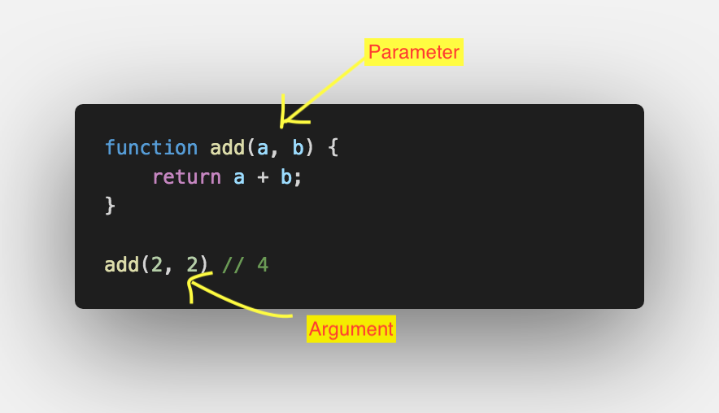
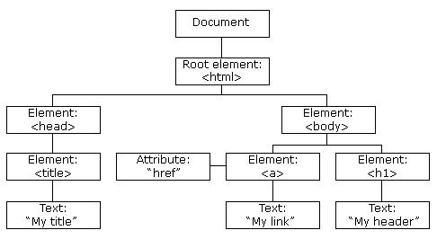

# Writing Test Week-2

# Javascript - Scope

Scope adalah konsep dalam flow data variabel. Terdapat jenis scope dalam javascript, yaitu
- global scope, 
- local scope.


## Global Scope

Global scope biasa disebut variabel global. Variabel global dapat diakses dan dimodifikasi hampir dimana saja di dalam kode program yang kita buat. 

Contoh global scope:

``` Javascript
var minuman = "Cappucino"; 

// disini kamu bisa menggunakan variabel 'minuman'

function simpleFunction() {   

// disini kamu bisa menggunakan variabel 'minuman'
}
```

## Local Scope

Local scope berarti kita mendeklarasikan variabel didalam blocks seperti function, conditional, dan looping.

Maka variabel hanya bisa diakses didalam blocks saja. Tidak bisa diakses diluar blocks.

Contoh local scope:

``` Javascript
// dibagian ini variabel 'minuman' tidak dapat diakses

function simpleFunction(){
  var minuman = "Cappucino";

  // jika variabel 'minuman' ditaruh di dalam sini maka variabel 'minuman' dapat diakses
}
```

# Javascript - Function

## Apa itu Function?
Function adalah sebuah blok kode dalam sebuah grup untuk menyelesaikan 1 task/1 fitur. Saat kita membutuhkan fitur tersebut nantinya, kita bisa kembali menggunakannya.

## Membuat dan Memanggil Function
Berikut ini cara membuat dan memanggil function di javascript dalam bentu pseudo-code.
```Javascript
function namaFungsi(parameter1, parameter2) {
       // Kode yang ingin dieksekusi
}
        console.log(namaFungsi(argumen1, argumen2))
```
contoh function dan cara memanggilnya
```Javascript
function hitung(p1, p2) {
			return p1+p2;
		}

		console.log(hitung(5,5));
```

## Parameter dan Argumen

Parameter Function
- Dengan parameter, function dapat menerima sebuah inputan data dan menggunakannya untuk melakukan task/tugas.
- Saat membuat function/fitur, kita harus tahu data-data yang dibutuhkan. Misalnya saat membuat function penambahan 2 buah nilai. Data yang dibutuhkan adalah 2 buah nilai tersebut.

Argumen Function
- Argumen adalah nilai yang digunakan saat memanggil function.
- Jumlah argumen harus sama dengan jumlah parameternya
- Jadi jika di function penambahan ada 2 parameter nilai saat membuat function. Saat memanggil function kita gunakan 2 buah nilai argumen.



perbedaan parameter dan argumen

<table>
<tr>
<th>PARAMETER</th>
<th>ARGUMEN</th>
</tr>
<tr>
<td>Parameter itu ibarat kamu butuh apa saja sih nantinya untuk menjalankan fungsi tersebut. Secara umum ada 2 istilah di pemrograman, input parameter dan output parameter.</td>
<td>Argumen itu ibarat value atau nilai dari parameter yang akan kamu kirimkan. Bisa berupa String, Integer, Object, Class, dan lain-lain. Secara umum juga ada 2 istilah, pass by reference dan pass by value.</td>
</tr>
</table>

## Default Parameters

Default paramaters digunakan untuk memberikan nilai awal/default pada parameter function.

## Function Helper

Kita bisa menggunakan function yang sudah dibuat pada function lain.

## Arrow Function

Arrow function adalah cara lain menuliskan function. Ini adalah fitur terbaru yang ada pada ES6 (Javascript Version)

## Short Syntax Function

- Nol Parameter
```javascript
const functionName = () => {}
```
- Satu Parameter
```javascript
const functionName = paramOne = {}
```
- Dua atau lebih Parameter
```javascript
const functionName = (paramOne, paramTwo) => {}
```
- Single Line Block
```javascript
const sumNumber = number => number +number
```
- Multi-Line Block
```javascript
const sumNumber = number => {
    const sum = number + number;
    return sum;
}
```

# Javascript Dasar - Data Type Built in Prototype and Method
## Data Type
  - Data Primitive
    - ```string``` merupakan deretan karakter yang diapit oleh sepasang tanda kutip (" ") berguna untuk menyimpan data yang dapat direpresentasikan dalam bentuk teks.
        - Properties

          1. Constructor
          
          Mengembalikan fungsi yang dibuat string prototipe objek
          
          2. Length
          
          Mengembalikan panjang string JavaScript
          ```javascript
          const str = 'skilvul';
          console.log(str.length); // Output: 7
          ```
          
          3. Prototype
          
          Menambah metode dan properti ke dalam sebuah objek
          ``` javascript
          String.prototype.reverse = function(){
            let s = " "
            for (let i = String(this).length-1; i >=0;
              i-- {
              s = s + String(this)[i]
            }
            return s
          }
          console.log("hallo".reverse()) //Output: 'ollah'
          ```
          
        - Method
        
          1. ```charAt()```

          Mengembalikan karakter pada index yang spesifik (posisi)
          ```javascript
          let hewan = 'Dinosaurus';
          console.log(hewan.charAt(4)); //Output : s
          ```

          2. ```indexOf()```
        
          Kembalikan posisi kemunculan pertama yang ditemukan dari teks yang ditentukan dalam sebuah string
          ```javascript
          const str = 'saya sedang belajar javascript';
          console.log(str.indexOf('a')); // 1 :: s(a)ya ...
          console.log(str.indexOf('ja')); // 16 :: ... bela(ja)r javascript
          ```

          3. ```lastIndexOf()```
          
          Kembalikan posisi kemunculan terakhir yang ditemukan dari teks yang ditentukan dalam sebuah string
          ```javascript
          const str = 'saya sedang belajar javascript';
          console.log(str.lastIndexOf('a')); // 23 :: ... belajar jav(a)script
          console.log(str.lastIndexOf('ja')); // 20 :: ... belajar (ja)vascript
          console.log(str.lastIndexOf('ja', 19)); // 16 :: ... bela(ja)r javascript
          ```
        
          4. ```replace()```
          
          Cari string untuk nilai dan kembalikan string baru dengan nilai yang diganti
          ```javascript
          const str = 'aku sedang belajar javascript';
          console.log(str.replace('aku', 'saya')); // saya sedang belajar javascript
          ```

          5. ```slice()```
          
          Ekstrak bagian dari string dan kembalikan string baru
          
          ```Sintaks : slice(indeksAwal, indeksAkhir);```
          ```javascript
          const str = 'saya sedang belajar javascript';
          console.log(str.slice(5, 11)); // sedang
          console.log(str.slice(5)); // sedang belajar javascript
          ```
          6. ```split()```
          
          Memisahkan string ke dalam array substring
          
          ```Sintaks : split(separator, limit);```
          ```javascript
          const str = 'saya sedang belajar javascript';
          console.log(str.split()); // ["saya sedang belajar javascript"]
          console.log(str.split(' ')); // ["saya", "sedang", "belajar", "javascript"]
          console.log(str.split(' ', 2)); //  ["saya", "sedang"]
          ```
          7. ```substring()```
          
          Ekstrak bagian dari string antara dua posisi yang ditentukan
          ```javascript
          const str = 'saya sedang belajar javascript';
          console.log(str.substring(1, 3)); // ay
          console.log(str.substring(5)); // sedang belajar javascript
          ```
          8. ```toLowerCase()```
          
          Ubah string menjadi huruf kecil
          ```javascript
          const str = 'Skilvul';
          console.log(str.toLowerCase()); //Output: skilvul
          ```
          
          9. ```toUpperCase()```
          
          Ubah string menjadi huruf besar
          ``` javascript
          const str = 'skilvul';
          console.log(str.toUpperCase()); //Output: SKILVUL
          ```
          
          10. ```trim()```
          
          Hapus spasi dari kedua ujung string
          ```javascript
          const str = '     skilvul      ';
          console.log(str.trim()); // 'skilvul'
          ```
          
          11.```includes()```
          
          Mengembalikan nilai true or false apalah dalam variabel ada string tersebut
          ```javascript
          let hewan = "Dinosaurus"
          console.log(hewan.includes("saur"); // Output : true
          ```


    - number - bilangan bulat, pecahan, dan lain-lain yang berbentuk angka

      ```javascript
      const a = 19;
      console.log(a); // 19
      console.log(typeof a); // number
      console.log(a instanceof Number); // false
      ```
        - Properties 
          
          (jarang digunakan, kebanyakan menggunakan methods number)
        - Methods
            1. ```isNan() --> NaN (Not a Number)```

            mengecek apakah ini bukan angka. Mengembalikan nilai Boolean, true jika nilai yang diuji NaN(bukan angka), false jika angka


            ```javascript
            isNan("hallo") //true
            isNan(12345) //false, karena ini angka
            isNan(true) //false, karena boolean true dianggap sebagai 1, dan 1 itu termasuk angka
            isNan("12345") //false, karena ada angka didalam string
            ```
            2. ```toString()```

            untuk mengubah angka menjadi string
            ```javascript
            let angka = 25
            angka.toString() //Output: '25'
            ```
            3. ```toFixed()```

            dapat menentukan jumlah angka dibelakang tanda koma. Return nilainya berupa string

            ```javascript
            let pi = 3.14159265
            pi.toFixed() //Output: '3'
            pi.toFixed(1) //Output: '3.1'
            pi.toFixed(4) //Output: '3.1415'
            ```

            4. ```parseInt() dan Number()```

            mengubah string menjadi number

            ```javascript
            myString = "27";
            console.log(parseInt(myString)); // Output: 27
            console.log(Number(myString)); //Output: 27
            ```

- Data Non-Primitive
  - Object

  contoh:
  ```javascript
  let a = [10]
  let b = a
  console.log(a === b) // true
  a.push(10)
  console.log(a) // [10, 10]
  console.log(a === b) // true
  ```
  - Array 
  - Function 
  
## Math
  
  mempermudah dalam perhitungan matematika
  
  contoh :
  ```javascript
  Math.pi //Output: 3.1415
  Math.LOG2E //Output: 1.4426
  Math.sqrt2 //Output: 1.4426 {menghitung akar dua}
  ```

  - Methods Math
  
    -   ```Math.abs()```
  
      mengembalikan nilai negatif menjadi nilai positif
      ```javascript
      Math.abs(-13) //Output: 13
       ```

    - ```Math.pow()```
    
    menghitung pangkat
    ```javascript
    Math.pow(3, 2) //Output: 9
    ```
    - ```Math.sqrt()```
    
    menghitung akar
    ```javascript
    Math.sqrt(9) //Output: 3
    ```
    - ```Math.round()```
    
    membulatkan angka
    ```javascript
    Math.round(123.456) //Output: 123
    ```

    - ```Math.floor()```
    
    membulatkan angka kebawah
    ```javascript
    Math.floor(4.4) //Output: 4
    Math.floor(4.9) //Output: 4
    ```
    - ```Math.ceil()```
    
    membulatkan angka keatas
    ```javascript
    Math.ceil(5.6) //Output: 6
    Math.ceil(5.1) //Output: 6
    ```

    - Math.random()
    
    menampilkan angka acak
    ```javascript
    console.log(Math.random() * 10);//output 9.495628210218175
    ```

# JavaScript (Introduction to DOM)

Pada tingkat paling dasar, situs web terdiri dari dokumen HTML dan CSS. Browser membuat representasi dokumen yang dikenal sebagai Document Object Model (DOM). Dokumen ini memungkinkan Javascript untuk mengakses dan memanipulasi elemen dan style situs web. Model ini dibangun dalam struktur objek dan mendefinisikan:

- Elemen HTML sebagai objek
- Properties dan event elemen HTML
- Method untuk mengakses elemen HTML



Elemen-elemen di atas disebut sebagai node. Tidak hanya elemen yang mendapatkan node tetapi atribut elemen dan teks juga mendapatkan node sendiri, yaitu attribute-node dan text-node.

## Traversing Cara mengkases DOM

- ```getElementbyId``` : mengambil elemen html menggunakan id. Merupakan salah satu method yang sering digunakan.
- ```getElementsbyClassName``` : mengambil elemen html berdasarkan nama class. Output berupa html collection karena class name bisa berupa jamak dan dapat digunakan lebih dari satu class. Cara mengaksesnya sama dengan array berupa indeks.
- ```geteElementsbyTagName``` : sama seperti ```getElementsbyClassName```, tapi mencari berdasarkan tag html yang digunakan.
- ```Children``` : mendapatkan elemen children dari parent
- ```querySelector``` : mengambil elemen html setiap elemen html dengan tag berkelas
- ```parentElement``` : mengambil parent element berdasarkan childnya
- ```closest``` : untuk mengakses parent
- ```previousElementSibling``` : akses elemen yang sejajar sebelum element tersebut
- ```nextElementSibling``` : sama dengan previousElementSibling setelah elemen tersebut

# JavaScript (DOM Manipulation)

Terdapat beberapa hal yang dapat kita lakukan untuk memanipulasi element HTML DOM dengan sintaks Javascript, antara lain :

- Mencari element dengan id tertentu. Dengan ```document.getElementById("header")```
- Mencari beberapa element sekaligus dengan class tertentu. Dengan documents.```getElementsByClassName("container")```
- Mencari element menggunakan kombinasi selector seperti pada CSS ```document.querySelector("#header p span")``` 

Selain itu juga terdapat beberapa cara untuk memanggil DOM Value, antara lain :

- Memanggil tag HTML berdasarkan ID ```console.log(document.getElementByID("header))```
- Memanggil tag HTML berdasarkan Class Name ```console.log(document.getElementByClassName("container"))```
- Memanggil tag html berdasarkan query selector ```console.log(document.querySelector("#header "))```

Mengubah Konten Element

- ```Element.textContent``` dapat digunakan untuk mengubah teks di dalam sebuah element. 
- ```Element.innerHTML``` dapat digunakan untuk mengubah konten HTML didalam sebuah element.

Membuat element HTML

- Element baru html kita bisa menggunakan method ```createElement()```

Menghapus Element

- Untuk menghapus element kita bisa menggunakan ```remove()```

# JavaScript (DOM Events dan DOM Form)

```Event``` berarti kejadian atau kegiatan atau interaksi yang terjadi pada website.

Event sendiri terdiri dari ;

- click
- submit
- focus
- blur
- hover
- change
- scroll

Terdapat 3 cara dalam memberikan event, yaitu :

1. HTML Attribute.
2. Event propperty.
3. addEventListener()
3. addEventListener()
