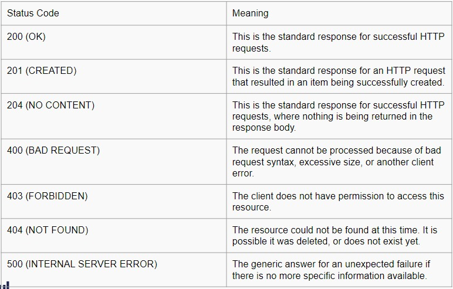
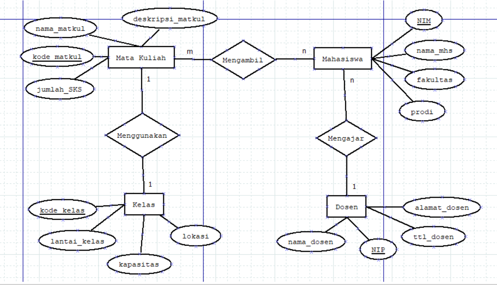
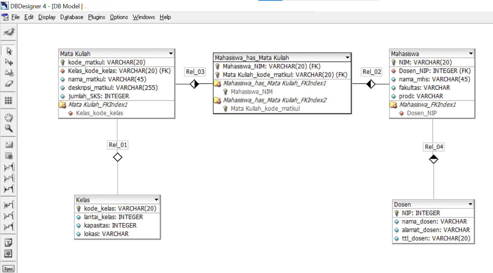
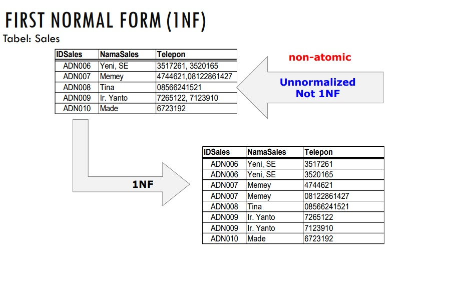

# Writing Test Week-5

# Web Server dan RESTful API

## Web Server
### Komponen Web Server
- Hardware
  > Di sisi hardware, server web adalah komputer yang menyimpan perangkat lunak server web dan file komponen situs web. (misalnya, dokumen HTML, gambar, CSS stylesheet, dan file JavaScript) Server web terhubung ke Internet dan mendukung pertukaran data fisik dengan perangkat lain yang terhubung ke web.
- Software
  > Di sisi software, server web mencakup beberapa bagian yang mengontrol bagaimana pengguna web mengakses file yang dihosting. Minimal, ini adalah server HTTP. Server HTTP adalah perangkat lunak yang memahami URL (alamat web) dan HTTP (protokol yang digunakan browser Anda untuk melihat halaman web). Server HTTP dapat diakses melalui nama domain situs web yang disimpannya, dan mengirimkan konten situs web yang dihosting ini ke perangkat pengguna akhir.
### Static Web Server VS Dynamic Web Server
- Static Web Server
  > Static Web Server, terdiri dari komputer (perangkat keras) dengan server HTTP (perangkat lunak). Kami menyebutnya "statis" karena server mengirimkan file yang dihosting apa adanya ke browser Anda.
- Dynamic Web Server
  > Sebuah server web dinamis terdiri dari server web statis ditambah perangkat lunak tambahan, paling sering server aplikasi dan database. Kami menyebutnya "dinamis" karena server aplikasi memperbarui file yang dihosting sebelum mengirim konten ke browser Anda melalui server HTTP
### Server Side Programming
>Web Server menunggu pesan permintaan klien, memprosesnya saat tiba, dan membalas browser web dengan pesan respons HTTP. Respons berisi baris status yang menunjukkan apakah permintaan berhasil atau tidak (misal "HTTP/1.1 200 OK" untuk berhasil). Isi respons yang berhasil atas permintaan akan berisi sumber daya yang diminta (misalnya halaman HTML baru, atau gambar, dll...), yang kemudian dapat ditampilkan oleh web browser.
### Static Sites
> Static sites menggunakan rendering sisi server untuk menyajikan file HTML, CSS, dan JavaScript yang telah dibuat sebelumnya ke browser web, berbeda dengan situs dinamis tradisional yang bekerja dengan merender halaman web pada saat permintaan.
### Dynamic Sites
> Dynamic sites adalah situs di mana beberapa konten respons dihasilkan secara dinamis, hanya bila diperlukan. Di situs web dinamis, halaman HTML biasanya dibuat dengan memasukkan data dari database ke dalam placeholder di template HTML (ini adalah cara yang jauh lebih efisien untuk menyimpan konten dalam jumlah besar daripada menggunakan situs web statis).
### Perbedaan Static Sites dan Dynamic Sites
- Memiliki tujuan dan perhatian yang berbeda.
- Umumnya tidak menggunakan bahasa pemrograman yang sama (pengecualiannya adalah JavaScript, yang dapat digunakan di sisi server dan klien).
- Berjalan di dalam sistem operasi yang berbeda.
### Yang dapat dilakukan di server-side
- Penyimpanan dan pengiriman informasi yang efisien
- Mengkostumisasi UX
- Akses terkontrol ke konten
- Store session/state information
- Notifikasi dan komunikasi
- Data analysis

## RESTful API
### Pengertian REST
- REST, atau REpresentational State Transfer, adalah gaya arsitektur untuk menyediakan standar antara sistem komputer di web, sehingga memudahkan sistem untuk berkomunikasi satu sama lain.
- Sistem yang sesuai dengan REST, sering disebut sistem RESTful, dicirikan oleh bagaimana mereka tidak memiliki kewarganegaraan dan memisahkan masalah klien dan server
### Komunikasi antara Klien dan Server
- Membuat Requests
  - REST mengharuskan klien membuat permintaan ke server untuk mengambil atau mengubah data di server. Permintaan umumnya terdiri dari:
    - kata kerja HTTP, yang mendefinisikan jenis operasi apa yang harus dilakukan
    - Header, yang memungkinkan klien untuk menyampaikan informasi tentang permintaan jalan menuju sumber daya
    - jalan menuju sumber daya
    - badan pesan opsional yang berisi data
- Kata Kerja HTTP
  - Ada 4 kata kerja HTTP dasar yang digunakan dalam permintaan untuk berinteraksi dengan sumber daya dalam sistem REST
    1. GET — mengambil resource tertentu (berdasarkan id) atau kumpulan sumber daya
    2. POST — membuat resource baru
    3. PUT — memperbarui resource tertentu (berdasarkan id)
    4. DELETE — menghapus resource tertentu dengan id
### Parameter Headers dan Accept
- Di header permintaan, klien mengirimkan jenis konten yang dapat diterimanya dari server. Ini disebut bidang Terima, dan ini memastikan bahwa server tidak mengirim data yang tidak dapat dipahami atau diproses oleh klien.
- Tipe lain dan subtipe yang umum digunakan :
  - image — image/png, image/jpeg, image/gif
  - audio — audio/wav, audio/mpeg
  - video — video/mp4, video/ogg
  - application — application/json, application/pdf, application/xml, application/octet-stream
### Paths
- Permintaan harus berisi jalur ke sumber daya tempat operasi harus dilakukan. Dalam RESTful API, jalur harus dirancang untuk membantu klien mengetahui apa yang sedang terjadi.
- Path seperti skilvulstore.com/customers/223/orders/12 jelas dalam apa yang ditunjuknya, bahkan jika Anda belum pernah melihat path khusus ini sebelumnya, karena path ini bersifat hierarkis dan deskriptif.
### Sending Responses
- Tipe Content
  - Misalnya, ketika klien mengakses resource dengan id 23 di sumber artikel dengan Permintaan GET ini:
    
    GET /articles/23 HTTP/1.1
    Accept: text/html, application/xhtml
    
    Server akan mengirim kembali konten dengan header respons :
    
    HTTP/1.1 200 (OK)
    Content-Type: text/html
    
### Response Codes
- Untuk setiap kata kerja HTTP, ada kode status yang diharapkan yang harus dikembalikan server setelah berhasil :
  1. GET — return 200 (OK)
  2. POST — return 201 (CREATED)
  3. PUT — return 200 (OK)
  4. DELETE — return 204 (NO CONTENT) jika operasi gagal, kembalikan kode status paling spesifik yang mungkin terkait dengan masalah yang ditemui.
<br>

# Intro Node.Js
### Tools
- Visual Studio Code (code editor)
- Browser latest version (Chrome, mozilla, opera, dll)
- Command Line Iinterface (mac / linux : terminal, windows : cmd)
- Node JS - https://nodejs.org/en
### Pengertian
> Node.js adalah open-source, lintas platform, back-end Javascript yang berjalan pada V8 engine dan mengeksekusi kode JavaScript di luar browser web. Node.js memungkinkan pengembang menggunakan JavaScript untuk menulis command line tools dan untuk skrip sisi server—menjalankan skrip sisi server untuk menghasilkan konten halaman web dinamis sebelum halaman dikirim ke browser web pengguna.
### Node JS Architecture
- *Single Thread*
  - Thread dalam ilmu komputer adalah eksekusi menjalankan beberapa tugas atau program secara bersamaan. Setiap unit yang mampu mengeksekusi kode disebut thread. Javascript menggunakan konsep single thread, yang berarti hanya memiliki satu tumpukan panggilan yang digunakan untuk menjalankan program.
- *Even Loop*
  - Dengan menggunakan konsep arsitektur javascript, walaupun menggunakan single thread tetapi kita dapat melihat javascript seperti menggunakan multi thread
  - Terdapat event queue yang berguna sebagai penampung ketika terdapat perintah baru yang akan dieksekusi.
  - Event loop akan memfasilitasi kondisi ini, event loop akan memeriksa terus menerus, ketika antrian kosong di call stack maka akan menambah antrian baru dari event queue sampai semua perintah selesai di eksekusi.
- *Server side scripting*
  - Sejatinya javascript merupakan bahasa pemrograman yang digunakan di front end side. Sehingga kita hanya bisa mengerjakan javascript dengan menggunakan browser untuk menampilkan hasil eksekusinya. Tetapi dengan menggunakan NodeJS kita dapat menjalankan javascript di server side menggunakan terminal command line menggunakan perintah “node”.
### Javascript For Node JS
- *Arrow Expression*
  > Arrow expression merupakan fitur terbaru dari javascript, yaitu mempermudah membuat sintaks function menggunakan “=>”
- *Asynchronous*
  > Asynchronous merupakan konsep yang paling penting dari javascript. Pada dasarnya, javascript mengeksekusi code secara single thread dan berurutan baris per baris yang disebut dengan synchronous. Sedangkan asynchronous memungkinkan mengeksekusi code tanpa berurutan dengan cara “skip” code dan melanjutkan eksekusi code selanjutnya. Konsep ini menungkinkan code kita tidak terjadi blocking dan lebih efisien.
- *JSON*
  > JSON atau Javascript Object Notation merupakan format yang digunakan untuk menyimpan dan mengirim data menggunakan konsep object di javascript. JSON dapat digunakan di hampir semua bahasa pemrograman sehingga sangat cocok untuk dipelajari
### Build In Module Node JS
- *Console*
  - Console merupakan module bawaan dari javascript yang ada di node JS untuk digunakan sebagai debug atau menampilkan code secara interface
  - Contoh :
    ```
    console.log("ini adalah console")
    ```
- *Process*
  - Process adalah modules yang digunakan untuk menampilkan dan mengontrol prosess Node JS yang sedang dijalankan.
  - Contoh :
    ```
    const process = require('process')
    const env = process.env
    
    env.foo = 'bar'
    console.log(env.foo) // bar
    ```
- *OS*
  - OS module merupakan module yang digunakan untuk menyediakan informasi terkait sistem operasi komputer yang digunakan user.
  - Contoh :
    ```
    let os = require('os')
    console.log("Platform: " + os.platform())
    console.log("Architecture: " + os.arch())
    
    //Platform: Darwin
    //Architecture: x64
    ```
- *Util*
  - Module Util merupakan alat bantu / utilities untuk mendukung kebutuhan internal API di Node JS
  - Contoh :
    ```
    const util = require('util')
    const debuglog = util.debuglog('foo')
    
    debuglog('hello from foo [%d]', 123)
    //FOO 3245 : hello from foo [123]
    ```
- *Events*
  - Contoh :
    ```
    const EvenEmitter = require('events')
    class myEmitter extends evenEmitter {}
    
    const myEmitter = new myEmitter()
    myEmitter.on('event', () => {
      console.log('an event occured!')
    })
    myEmitter.emit('event')
    ```
- *Errors*
  - Errors merupakan modules yang dapat digunakan untuk mendefinisikan error di Node JS sehingga lebih informatif. Kita juga dapat menghandle error menggunakan try catch
  - Contoh :
    ```
    try {
      const m = 1
      const n = m +
    } catch (err) {
      //handle error
    }
    ```
- *Buffer*
  - Buffer merupakan modules yang digunakan untuk mengakses, mengelola dan mengubah tipe data raw atau tipe data bytes.
  - Contoh :
    ```
    import { Buffer } from 'buffer'
    const buf = Buffer.from('hello world','utf8')
    console.log(buf.toString('hex'))
    console.log(buf.toString('base64'))
    ```
- *FS*
  - Fs atau “file system” merupakan module yang dapat membantu berinteraksi dengan file yang ada diluar code. FS paling sering digunakan untuk membaca file dengan ekstensi .txt, .csv, dan .json
  - Contoh :
    ```
    import { readFileSyny } from 'fs'
    readFileSync('<directory>')
    ```
- *Timers*
  - Timers merupakan modules yang digunakan untuk melakukan scheduling atau mengatur waktu pemanggilan fungsi yang dapat diatur di waktu tertentu
  - Contoh :
    ```
    import{
      setTimeout,
    } from 'timers/promises'
    const res = await setTimeout(100, 'result')
    console.log(res)
    //Prints 'result'
    ```
### Membuat Web Server Dengan Node JS
- *Node JS Web Server*
  - Node.js memiliki built-in modul yang disebut HTTP, built-in modul ini memungkinkan Node JS mentransfer data melalui Hyper Text Transfer Protocol (HTTP).
  - Modul HTTP dapat membuat server HTTP yang mendengarkan port server dan memberikan respons kembali ke klien.
  - Untuk menggunakan modul HTTP, gunakan require()
  - Gunakan method createServer() untuk membuat server HTTP
  - Callback function yang digunakan pada method http.createServer(), akan dijalankan ketika seseorang mencoba mengakses komputer pada port 8080.
  - Contoh :
    ```
    const http = require('http')
    
    http.createServer(function(req, res) => {
      res.write('Hello World')
      res.end()
    }).listen(8080)
    ```
- *Menambahkan HTTP Header*
  - Kita bisa menggunakan method res.writeHead() untuk menambahkan header HTTP.
  - Argumen pertama dari method res.writeHead() adalah status code, 200 berarti semuanya OK
  - Argumen kedua adalah objek yang berisi header respons.
  - Contoh : 
    ```
    const http = require('http')
    
    http.createServer(function(req, res) => {
      res.writeHead(200, {'Content-Type': 'text/html'})
      res.write('Hello World')
      res.end()
    }).listen(8080)
    ```
  - Respons yang dikembalikan dari HTTP web server bisa dalam berbagai format.
  - Contohnya, Kita bisa mengembalikan response dalam format JSON dan HTML, namun kita juga dapat mengembalikan format teks lain seperti XML dan CSV.
  - Selain itu web server dapat mengembalikan data non-teks seperti PDF, file zip, audio, dan video.
  - Format ini harus ditambahkan kedalam HTTP Header.
- *Membaca Query String*
  - Callback function pada method http.createServer() memiliki argumen req yang mewakili request dari klien, sebagai objek (objek http.IncomingMessage).
  - Objek ini memiliki sebuah properti yang disebut "url" yang menyimpan informasi url yang sedang mengakses.
  - Contoh :
    ```
    const http = require('http')
    
    http.createServer(function(req, res) => {
      res.writeHead(200, {'Content-Type': 'text/html'})
      res.write(req.url)
      res.end()
    }).listen(8080)
    ```
- *Split Query String*
  - Ada build-in module yang bisa kita gunakan untuk split query string menjadi beberapa bagian yang dapat dibaca.
  - Build-in modulenya adalah URL Module.
  - Contoh :
    ```
    const http : require('http')
    const url : require('url')
    
    http.createServer(function(req, res) => {
      res.writeHead(200, {'Content-Type': 'text/html'})
      const query = url.parse(req.url, true).query
      let txt = q.year + " " + q.month 
      res.end(txt)
    }).listen(8080)
    ```

# Express.js

Express.js adalah framework web app untuk Node.js yang ditulis dengan bahasa pemrograman JavaScript. Framework open source ini dibuat oleh TJ Holowaychuk pada tahun 2010 lalu.

Express.js adalah framework back end. Artinya, ia bertanggung jawab untuk mengatur fungsionalitas website, seperti pengelolaan routing dan session, permintaan HTTP, penanganan error, serta pertukaran data di server. 

### Installation and Preparation Express.js

- Karena expressJS adalah sebuah modules atau package yang dikembangkan menggunakan bahasa javascript, maka kita bisa menggunakan NPM untuk menginstall express JS
 ```js
 npm install express --save
 ```
- Terdapat beberapa module yang perlu diinstal untuk mempermudah develop server side application, seperti nodemon (agar dapat restart application otomatis selama proses development)
```js
npm install --save-dev nodemon
```

### Basic Syntax ExpressJS


diatas adalah basic syntax dari express JS. Kita akan menggunakan module express yang berisi routing dan listen.
- Basic Routes

    Routes adalah sebuah end point yang diapat kita akses menggunakan URL di website. Didalam routes kita perlu menentukan method API, alamat dan response apa saja yang akan dikeluarkan

    .png)

    Kita bisa menjalankan aplikasi sederhana kita dengan cara menggunakan “node”. Dan aplikasi kita akan berjalan di alamat ‘http://localhost:3000’
    
    Kemudian kita dapat mengaksesnya di website dan menambah route yang akan kita akses yaitu “/”

    .png)

### Method ExpressJS

Kita dapat menggunakan method dalam REST API seperti `GET`,`POST`, `PUT`, `PATCH` dan `DELETE`

### Response ExpressJS

Kita dapat mengirim response berupa output json yang biasa dipakai untuk back end application. Dengan menggunakan output json maka kita dapat mengirim data yang mudah diakses.

Objek `res` mewakili respons HTTP yang dikirim oleh aplikasi Express saat mendapat permintaan HTTP.

Dalam dokumentasi ini dan menurut konvensi, objek selalu dirujuk sebagai `res`(dan permintaan HTTPnya adalah `req`) tetapi nama sebenarnya ditentukan oleh parameter ke fungsi panggilan balik tempat Anda bekerja.

Sebagai contoh:
```js
app.get('/user/:id', function (req, res) {
  res.send('user ' + req.params.id)
})
```
Di dalam route kita dapat mengirim response menggunakan parameter dari route express.js yaitu `res.Send()` untuk mengirim plain text ketika kita mengakses route tersebut.

- Properties
    - `res.app`
    - `res.headersSent`
    - `res.locals`
- Methods
    - `res.append()`
    - `res.attachment()`
    - `res.cookie()`
    - `res.clearCookie()`
    - `res.download()`
    - `res.end()`
    - `res.format()`
    - `res.get()`
    - `res.json()`
    - `res.jsonp()`
    - `res.links()`
    - `res.location()`
    - `res.redirect()`
    - `res.render()`
    - `res.send()`
    - `res.sendFile()`
    - `res.sendStatus()`
    - `res.set()`
    - `res.status()`
    - `res.type()`
    - `res.vary()`

Documentation : http://expressjs.com/en/api.html#res

### Status Code

HTTP status code merupakan istilah umum yang digunakan untuk menyebut HTTP status line yang mencakup HTTP status code dan HTTP reason phase.

Namun, kebanyakan pengguna internet menyebut kode status ini sebagai kode error browser atau kode error intenal server.

Ini karena HTTP status line 500: Internal Server Error terdiri dari kode status HTTP 500 dan HTTP reason phase Internal Server Error.

<b>Macam-Macam HTTP Status Code</b>

Secara umum, terdapat lima kategori HTTP status code, yaitu 
- kode respon informasi, 
- respon sukses,
- pengalihan,
- kode error respon klien, dan kode error server.

Namun, tidak semua kategori tersebut mengindikasi terjadinya kesalahan saat memuat website.

Sebagian kode status dari beberapa kategori hanyalah indikasi dari respon yang diberikan server ketika memuat laman website.

Namun, ada beberapa macam HTTP status code yang umum ditemukan.

- Kode respon klien error (kode 4xx)
    
    - `400 Bad Request`
        
        Kode ini menunjukkan bahwa server tidak memahami permintaan dikarenakan syntax yang invalid.
            
    - `401 Unauthorized`
        
        HTTP status code ini adalah kode yang dikirim ketika permintaan tidak terautentifikasi. Sehingga, kamu harus melakukan autentikasi untuk mendapatkan respons yang diminta.
            
    - `402 Payment Required`
        
        Kode ini masih dalam pengembangan dan baru akan digunakan di masa mendatang.
            
        Tujuan awal pembuatan kode ini adalah menggunakannya untuk sistem pembayaran digital, namun kode status ini sangat jarang digunakan dan tidak ada ketentuan standar.
            
    - `403 Forbidden`
            
        Kode status ini biasanya muncul ketika kamu membuka sebuah laman yang tidak kamu miliki aksesnya. Berbeda dengan kode status 401, server akan mengidentifikasimu sebagai pengguna.
            
    - `404 Not Found`
            
        Kode ini adalah HTTP status code yang paling umum ditemukan. Di browser, ini berarti URL tidak dikenali.
            
        Server juga dapat mengirimkan kode respons ini alih-alih 403 untuk menyembunyikan keberadaan sumber daya dari klien yang tidak sah.
            
    - `408 Request Timeout`
            
        Kode ini dikirim pada koneksi yang tidak aktif oleh beberapa server, bahkan tanpa permintaan sebelumnya oleh klien.
            
        Artinya, server ingin mematikan koneksi yang tidak digunakan ini.

Respons ini digunakan lebih banyak karena beberapa browser, seperti Chrome, Firefox 27+, atau IE9, menggunakan mekanisme pra-koneksi HTTP untuk mempercepat penjelajahan.

- Kode respon server error (5xx)

    - `500 Internal Server Error`
    
        HTTP status code ini adalah kode yang dikirimkan ketika server mengalami situasi yang tidak diketahui cara menanganinya.

    - `502 Bad Gateway`
    
        Respons kesalahan ini berarti bahwa server, saat bekerja sebagai gateway untuk mendapatkan respons yang diperlukan untuk menangani permintaan, mendapat respons yang tidak valid.

    - `503 Service Unavailable`
    
        Kode ini akan muncul ketika server tidak siap untuk menangani permintaan tersebut. Penyebab umumnya adalah server tidak aktif karena pemeliharaan atau kelebihan beban.

    - `504 Gateway Timeout`
    
        Kode status ini akan muncul saat server bertindak sebagai gateway dan tidak bisa mendapatkan respons tepat waktu.

    - `511 Network Authentication Required`
    
        Kode status 511 menunjukkan bahwa kamu perlu melakukan otentikasi untuk mendapatkan akses jaringan.

Source : https://developer.mozilla.org/en-US/docs/Web/HTTP/Status
    
### Query

Query merupakan parameter yang digunakan untuk membantu menentukan tindakan yang lebih spesifik daripada hanya sekedar router biasa. Biasanya query ditaruh di akhir route dengan memberikan informasi diawali dengan “?” kemudian tedapat key dan data yang dapat ditindak lanjuti. `Ex : “?q=hello&age=23”` 

Bagi yang sadar, ketika kita search di google maka terdapat query di route yang kita akses

.png)

### Nested route

Nested route digunakan ketika terdapat banyak route yang memiliki nama yang sama atau ingin membuat route yang lebih mendalam

### Express Middleware

Apa Itu Middleware ?

`Middleware function` adalah sebuah fungsi yang memiliki akses ke `object request (req)`, `object response (res)`, dan sebuah `fungsi next` didalam request-response cycle.

>`Fungsi next` biasanya di berikan nama variable next.

.png)

<b>Bagaimana Cara Middleware Bekerja?</b>

Secara umum, prinsip kerja Middleware adalah mencegat request yang masuk untuk kemudian diproses terlebih dahulu sebelum diberikan kepada Controller yang dituju atau diarahkan ke Controller yang lain. Dengan menggunakan fitur ini, kita dapat membuat komponen yang reusable untuk melakukan pekerjaan-pekerjaan tersebut.

<b>Apa Saja Yang Bisa Dilakukan Oleh Function Middleware?</b>

- Menjalankan kode apapun.
- Memodifikasi Object Request dan Object Response.
- Menghentikan request-response cycle.
- Melanjutkan ke middleware function selanjutnya atau ke handler function dalam suatu request response cycle.

<b>Jenis Express Middleware</b>

- Berdasarkan Cara Penggunaan
    - Application Level Middleware
    - Router Level Middleware
    - Error Handling Middleware
- Berdasarkan Cara Penggunaan : Application Level Middleware
    - Application Level Middleware adalah sebuh function middleware yang melekat ke instance object Application Express.
    - Penggunaannya dengan cara memanggil method app.use().
    - Application Level Middleware akan di jalankan setiap kali Express Application menerima sebuah HTTP Request.
- Berdasarkan Cara Penggunaan : Router Level Middleware
    - Router Level Middleware adalah sebuh function middleware yang cara kerjanya sama persis dengan application level middleware, yang menjadikan perbedaan adalah middleware function ini melekat ke instance object Router Express.
    - Penggunaannya dengan cara memanggil method express.Router().
    - Router Level Middleware hanya akan di jalankan setiap kali sebuah Express Router yang menggunakan middleware ini menerima sebuah HTTP Request, sedangan pada Router yang lain tidak akan dijalankan.
- Berdasarkan Source Middleware Function
    - Express Build-in Middleware
        - express.static()
        - express.json()
        - express.urlEncoded()
    - Third Party (custom) Middleware

# Design Database with MySQL
### Entity / Entitas
>adalah kumpulan objek yang dapat diidetifikasikan secara unik atau berbeda. Biasanya simbol dari entitas adalah persegi panjang
### Atribut
>berfungsi untuk mendeskripsikan karakteristik dari entitas tersebut. Simbol dari atribut adalah elips
### Relasi
>adalah hubungan antara entitas
### Membuat Design Database
1. Menggunakan website/aplikasi pembuat diagram, contohnya : aplikasi atau website draw.io
<br>
>Penjelasan :
- Ada 4 entitas yaitu : Kelas, Mata Kuliah, Mahasiswa, dan Dosen
- Relasi : 
  - 1 kelas dapat digunakan oleh 1 mata kuliah -> relasinya adalah one to one
  - 1 dosen dapat mengajar banyak/beberapa mahasiswa -> relasinya adalah one to many
  - 1 mahasiswa dapat mengambil beberapa mata kuliah | 1 mata kuliah dapat diambil oleh beberapa mahasiswa -> relasinya adalah many to many
- Atribut :
  - Entitas kelas memiliki 4 atribut : kode_kelas(sebagai primary key), lantai_kelas, kapasitas, dan lokasi
  - Entitas mata kuliah memiliki 4 atribut : kode_matkul (primary key), jumlah_SKS, nama_matkul, dan deskripsi_matkul
  - Entitas mahasiswa memiliki 4 atribut : NIM (primary key), nama_mhs, fakultas, dan prodi
  - Entitas dosen memiliki 4 atribut : NIP (primary key), nama_dosen, alamat_dosen, dan ttl_dosen
  >Primary key adalah sesuatu yang isinya tidak akan sama dengan yang lain. Contohnya NIM mahasiswa satu dengan mahasiswa lain tidak sama, pasti berbeda-beda
2. Relationship/Relasi Entity Keseluruhan
<br>

## Design Database With MySQL (Lanjutan)
- ### Membuat design db data film kesukaan :
- mahasiswa dapat menyukai banyak film
<br>.jpeg)

- Mahasiswa dapat menyukai banyak film. tiap film memiliki informasi terkait genre, tiap film mempunyai banyak genre
<br>.jpeg)

- ### Apa Itu Primary Key Dan Foreign Key Di SQL Database?
- primary key adalah tanda pengenal unik yang membedakan satu record dari yang lain. Oleh karena itu, setiap record dalam SQL database management system harus memiliki primary key.

    ada beberapa aturan yang harus kalian ikuti ketika menentukan primary key untuk tabel:
    
     - Primary key harus berisi nilai unik
     - Kolom primary key tidak boleh berisi nilai NULL
     - Sebuah tabel hanya memiliki satu primary key
     

- Foreign key adalah pengenal unik atau kombinasi pengenal unik yang menghubungkan dua tabel atau lebih dalam database.

    Saat memutuskan tabel mana dalam database relasional yang harus memiliki foreign key, harus terlebih dahulu mengidentifikasi tabel mana yang merupakan subjek dan objek dalam hubungannya.

- Perbedaan Primary Key Dan Foreign Key

    - Tidak ada dua baris yang dapat memiliki value identik untuk primary key sedangkan Foreign key dapat berisi value duplikat.
    
    - Tidak ada batasan dalam memasukkan value ke dalam kolom tabel primary key ssedangkan Saat memasukkan value apa pun dalam tabelforeign key, pastikan bahwa value tersebut ada di kolom primary key.
    
    - dapat memiliki satu primary key dalam sebuah tabel sedangkan foreign key dapat memiliki beberapa dalam satu tabel.
    
 - Unnormalized Form

    Unnormalized Form adalah suatu kondisi dimana sebuah tabel yang memiliki rangkap atau data yang terduplikasi.  Unnormalized Form ini sebenarnya adalah kumpulan data data mentah yang dimasukkan semua dalam satu tabel yang sama (tidak dipecah ke tabel lain). Data tersebut di input dengan apa adanya dan tidak dipilah sesuai dengan jenisnya.
    

  - NORMALISASI
  
    proses pengelompokan atribut data yang membentuk entitas sederhana, nonredundan, fleksibel, dan mudah beradaptasi, Sehingga dapat dipastikan bahwa database yang dibuat berkualitas baik.

    
  - 1nf
     
     Suatu relasi disebut memenuhi bentuk normal pertama (1NF) jika dan hanya jika
setiap atribut dari relasi tersebut hanya memiliki nilai tunggal dan tidak ada
pengulangan grup atribut dalam baris. Bentuk 1NF tidak boleh mengandung grup atribut yang berulang.
 Tujuan membentuk 1N

<br>

   - 2nf
   
   Suatu relasi disebut memenuhi bentuk normal kedua (2NF) jika dan hanya jika memenuhi 1NF, setiap atribut yang bukan kunci utama tergantung secara fungsional terhadap semua atribut kunci dan bukan hanya sebagian atribut kunci (fully functionally dependent).

.jpeg)

.jpeg)

.jpeg)

  - 3nf
  
  Suatu relasi disebut memenuhi bentuk normal ketiga (3NF) jika dan hanya jika memenuhi 2NF, setiap atribut yang bukan kunci tidak tergantung secara fungsional terhadap atribut bukan kunci yang lain dalam relasi tsb (tidak terdapat ketergantungan transitif pada atribut bukan kunci).
  
  Jika suatu relasi sudah memenuhi 2NF tapi tidak memenuhi 3 NF, maka untuk normalisasi ke bentuk 3NF, tabel 2NF didekomposisi menjadi beberapa tabel hingga masing-masing memenuhi 3NF. 
  
.jpeg)

.jpeg)

.jpeg)

.jpeg)