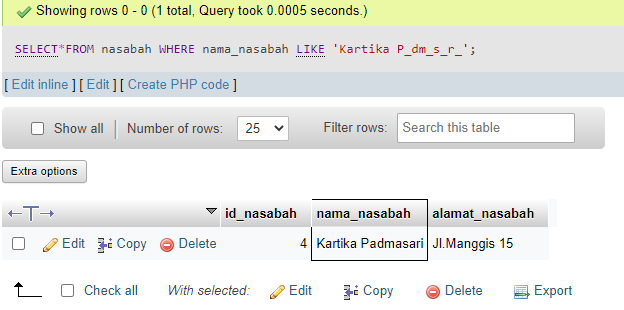

# Writing Test Week-6

# DAY 6 | Database

> Database adalah kumpulan tabel yang berisi informasi yang disimpan didalam komputer secara sistematik dan saling berelasi
### DBMS(Database Management System) 
> software untuk membuat database. Dapat digunakan oleh user untuk berkomunikasi dengan data yang ada dalam media penyimpanan


### MySQL
> sistem manajemen database relasional (RDBMS) open-source berbasis SQL yang bekerja dengan model client-server

Cara Install MySQL :
- link : https://dev.mysql.com/downloads/installer (windows dan MacOS)

### **Istilah pada Database**

1. Table
> kumpulan value yang dibangun oleh baris dan kolom, didalamnya berisi atribut dari sebuah data
2. Field
> kolom dari sebuah tabel, masing-masing field memiliki tipe data masing-masing
3. Record
> Record merupakan isi dari sebuah tabel

### **SQL(Structured Query Language)**
> bahasa yang digunakan untuk mengakses database

#### **Data Type SQL**
1. Number : berisi kumpulan karakter angka
<br> ada int, float, dan decimal
2. String : berupa kumpulan karakter termasuk karakter simbol
<br> char, varchar, text, enum
3. Boolean : hanya ada TRUE dan FALSE
4. Date Time : untuk menyimpan tanggal dan waktu
<br> date, datetime, time, timestamp
5. Other
<br>default(tipe data untuk set default value jika tidak di assign dengan value) dan null(Tipe data kosong atau tipe data yang belum di assign dengan value / data)

#### **Key**
1. Primary Key
<br> sebagai identifikasi untuk membedakan satu baris dengan baris lainnya dalam suatu tabel. Pada dasarnya, setiap tabel hanya memiliki satu primary key saja
2. Foreign Key
<br>sebuah atribut atau gabungan atribut yang terdapat dalam suatu tabel yang digunakan untuk menciptakan hubungan (relasi) antara dua tabel. 

#### **Database Command**
- menunjukkan seluruh list database di mysql kita
    ```sql
    SHOW DATABASES;
    ```
- membuat database baru
    ```sql
    CREATE DATABASE university;
    ```
- menggunakan database yang sudah ada
    ```sql
    USE university;
    ```
- menghapus / menghilangkan database yang dipilih dari MySQL kita
    ```sql
    DROP DATABASES university;
    ```
- melakukan ordering 
<br> ORDER BY dengan menggunakan 2 kondisi yaitu ASC dan DESC.
- mengelompokkan data berdasarkan kondisi
<br> menggunakan GROUP BY
- membatasi query
<br> menggunakan LIMIT

#### **Fungsi Dasar MySQL**

1. DDL(Data Definition Language)
> kumpulan perintah SQL yang digunakan untuk membuat, mengubah dan menghapus struktur dan definisi metadata dari objek-objek Database

Terdapat lima perintah penting dalam DDL, yaitu **CREATE, ALTER, RENAME, SHOW dan DROP**.
- CREATE
<br> membuat sebuah database yang baru
    ```sql
    create table kelas(
        kode_kelas varchar(20) primary key,
        lantai integer not null,
        kapasitas integer not null,
        lokasi varchar(255) not null
    );
    ```
- ALTER
<br> digunakan untuk mengubah struktur dari tabel yang ada, seperti untuk menambahkan atau menghapus kolom/field, membuat atau menghapus primary key, mengubah jenis kolom/field yang ada, juga mengubah kolom atau nama tabel.
- RENAME
<br> Perintah rename digunakan untuk mengubah nama table, apabila sebuah tabel ingin diganti namanya
    ```sql
    RENAME TABLE kelas TO kelas_baru
    ```
- DROP
<br> menghapus baik itu berupa database, table maupun kolom hingga index
    ```sql
    DROP DATABASE nama_database
    ```
2. DML(Data Manipulation Language)
> untuk melakukan manipulasi data atau pengolahan data atau record dalam table pada sebuah database

Terdapat empat perintah yang ada dalam DML, yaitu **INSERT, SELECT, UPDATE, dan DELETE**
- INSERT
<br> untuk memasukkan sebuah record baru di dalam sebuah tabel database
    ```sql
    INSERT INTO nama_tabel VALUES (data1, data2, dst);
    ```
- SELECT
<br> menampilkan maupun mengambil sebuah data pada tabel
    ```sql
    SELECT nama_kolom1, nama_kolom2 FROM nama_tabel;
    ```
- UPDATE
<br> untuk mengubah data, atau memodifikasi data yang terdapat didalam tabel
    ```sql
    UPDATE nama_tabel SET kolom1=data1, kolom2=data2, WHERE kolom=data;
    ```
- DELETE
<br>untuk menghapus data atau record di dalam table
    ```sql
    DELETE FROM nama_tabel WHERE kolom=data;
    ```


### Data Relationship
> relasi atau hubungan antara beberapa tabel dalam bahasa yang kita miliki. Relasi antar tabel dihubungkan oleh Primary key dan foreign key (atribut yang melengkapi relationship dan menunjukan hubungan antara tabel induk dengan tabel anak)
#### **Tipe Database Relationship**
1. One to One
<br> contohnya adalah relasi antara tabel jam mata kuliah dengan ruang kelas. 1 mata kuliah dilaksanakan dalam 1 kelas, 1 kelas hanya diisi dengan 1 mata kuliah disaat jam tersebut
2. One to Many
<br> contohnya adalah relasi antara tabel dosen pembimbing akademik dengan tabel mahasiswa. 1 mahasiswa hanya boleh memiliki 1 dosen pembimbing, namun 1 dosen pembimbing akademik dapat memiliki lebih dari 1 mahasiswa
3. Many to Many
<br> contohnya adalah relasi antar tabel mahasiswa dan tabel mata kuliah. 1 mahasiswa dapat mengambil banyak mata kuliah, dan 1 mata kuliah dapat diambil oleh banyak mahasiswa

# DAY 7 | MySQL Lanjutan

## Tipe-tipe Relations pada MySQL

- One to One (Sangat jarang digunakan)

Diimplementasikan dengan cara yang sama seperti One to Many tetapi dengan kondisi tambahan (foreign key merupakan primary key)


- One to Many (Paling Sering Digunakan)

Satu baris dalam tabel dapat memiliki beberapa baris di table relasinya.


- Many to Many

Digunakan ketika kedua tabel yang berelasi dapat memiliki beberapa baris di tabel relasinya.


## Konsep Database Normalization

Normalisasi database (Database normalization) adalah proses penyusunan kolom dan tabel untuk meminimalkan redundansi data (data yang berulang). Normalisasi biasanya akan membagi tabel besar menjadi beberapa tabel kecil yang saling terhubung. Hal ini dilakukan agar mudah dalam mengatur, dan mengorganisasi data yang ada.

Dari wikipedia, normalisasi database setidaknya memiliki 9 tahapan. Pada setiap tahapan, ada syarat yang harus dipenuhi, sampai sebuah tabel tidak lagi memiliki kolom yang redundant. Kita tidak harus mengikuti semua tahap, biasanya hanya dibutuhkan 3 tahapan normalisasi untuk membuat sebuah desain database sederhana. Proses normalisasi database tidak akan kita bahas disini, namun setidaknya kita mengetahui bahwa `normalisasi database adalah proses untuk mendesain database agar terorganisir`.

### Tujuan Database Normalization

- Menghilangkan redundan data pada database.
- Memudahkan juka ada perubahan struktur table database.
- Memperkecil pengaruh jika ada perubahan dari struktur table database

### Efek Jika Tidak Melakukan Database Normalization

- `INSERT Anomali`
    
    Situasi dimana tidak memungkinkan memasukkan beberapa jenis data secara langsung di database.

- `DELETE Anomali`
    
    Penghapusan data yang tidak sesuai dengan yang diharapkan, artinya data yang harusnya tidak terhapus mungkin ikut terhapus.

- `UPDATE Anomali`

    Situasi dimana nilai yang diubah menyebabkan inkonsistensi database, dalam artian data yang diubah tidak sesuai dengan yang diperintahkan atau yang diinginkan.

### Bentuk-Bentuk Normalisasi Database

Salah satu membuat normalisasi adalah untuk memastikan bahwa model data relasional dapat berjalan dengan baik. Bentuk-bentuk normalisai terdiri dari beberapa bagian diantaranya:

1. Bentuk Normal Pertama (First Normal Form) (1NF)

    - Menghilangkan multiple value pada sebuah kolom table database
    
        Sebuah table memenuhi kaidah 1NF jika :
        - Setiap kolom bernilai tunggal (single value
        - Setiap kolom memiliki nama yang unik
        - Urutan penyimpanan data tidak menjadi masalah


2. Bentuk Normal Kedua (Second Normal Form) (2NF)

    - Harus sudah dalam bentuk 1NF untuk mendapatkan 2NF.
    - Menghapus beberapa subset data yang ada padatabel dan menempatkan mereka pada tabel terpisah.


3. Bentuk Normal Ketiga (Third Normal Form) (3NF)

    Menghilangkan seluruh atribut atau field yang tidak berhubungan dengan primary key. Dengan demikian tidak ada ketergantungan transitif pada setiap kandidat key.

Masih ada banyak bentuk database normalisasi, diantaranya :
- EKNF
- BCNF
- 4NF
- 5NF
- DKNF
- 6NF

## Key pada MySQL

- `Super Key`

    Satu atau lebih atribut yang dapat membedakan setiap baris data dalam sebuah tabel secara unik. Bisa jadi ada lebih dari satu kumpulan atribut yang yang bersifat super key dalam sebuah tabel.
    
    > Contoh : Nim, Nama, alamat, Tgl_lahir

- `Candidate Key`

    Merupakan kumpulan atribut minimal yang dapat membedakan setiap baris dalam sebuah tabel secara unik. Sebuah candidate key tidak boleh berisi atribut atau kumpulan atribut yang telah menjadi superkey yang lain, 
    
    > contoh : nim, nama(jika tidak ada nilai yang berulang didalamnya).

- `Primary Key`
    
    Primary Key adalah atribut merupakan candidate key yang telah dipilih untuk mengidentifikasi setiap record secara unik. 

    Primary Key harus merupakan atribut yang benar-benar unik dan tidak boleh ada nilai NULL. Primary Key adalah suatu nilai dalam basis data yang digunakan untuk mengidentifikasi suatu baris dalam tabel. 
    
    > Contoh : NIM.

- `Alternate Key`

    Alternate Key adalah primary key yang tidak terpilih. Misal : dalam suatu entitas terdapat dua atribut yang bisa dijadikan sebagai primary key. 

    Sementara yang boleh dijadikan primary hanya satu, maka kita harus memilih salah satu. Atribut yang dipilih, disebut primary key. sedangkan atribut yang tidak dipilih disebut dengan alternate key.

    > Contohnya misalkan ada no_ktp dan NIM dalam sebuah tabel, maka kedua atribut tersebut dapat dijadikan sebagai primary key, namun hanya ada satu primary key dalam sebuah tabel jadi harus dipilih salah satu saja. 

- `Unique Key`

    Kumpulan dari satu atau lebih fields/columns di sebuah table database yang secara unik mengidentifikasi sebuah record dalam table database tersebut.

    Hampir sama dengan Primary key, namun value dari Unique Key bisa berupa satu buah null value di dalam sebuah table database, dan Unique Key tidak bisa memiliki duplicate values

- `Foreign Key`

    Jika sebuah primary key terhubungan ke tebel lain, maka keberadaan primary key pada tersbut di sebut sebagai foreign key. 

    Foreign key adalah atribut dalam satu relasi yang digunakan untuk menunjuk ke suatu baris pada relasi yang lain, jadi foreign key ini digunakan untuk membuat sebuah relasi yang trerjadi antara tabel A dengan tabel B, dimana ketika tabel A memebuat sebuah relasi dengan tabel B maka di tabel B primary key tabel A akan menjadi foreign key di tabel B.


## Join Multiple Tables pada MySQL

Mengambil records dari dua atau lebih table database yang memiliki relationship dan akan di sajikan dalam single result set.

- `INNER JOIN`

    Semua baris akan diambil dari kedua table yang akan di JOIN, selama columns cocok dengan kondisi yang sudah di tentukan.
    
    Memungkinkan baris dari salah satu tabel muncul di hasil jika dan hanya jika kedua tabel memenuhi kondisi yang ditentukan dalam klausa ON.

    Misalkan terdapat table A dan B, maka hasil inner join dapat diperlihatkan sebagai bidang terasir dalam diagram Venn sebagai berikut :

    

- `LEFT JOIN`

    Pada JOIN ini, semua records dari table di sisi kiri JOIN statement akan di pilih.

    Jika record yang di pilih dari table kiri tidak memiliki record yang cocok pada table JOIN yang kanan, maka record tersebut masih dipilih, dan kolom pada table yang kanan akan bernilai NULL. 

    Left outer join antara tabel A dan B dapat diilustrasikan dalam diagram Venn sebagai berikut :

    

- `RIGHT JOIN`

    right join mengembalikan semua nilai dari table kanan ditambah dengan nilai dari tabel kiri yang sesuai atau NULL jika tidak ada nilai yang sesuai

    Right outer join antara tabel A dan B dapat diilustrasikan dalam diagram Venn sebagai berikut :

    

## Aggregate Function pada MySQL

Fungsi-fungsi untuk aggregate:

- `MIN()`

    Digunakan untuk mencari nilai terkecil dari sekumpulan record.
    
    ```
    Contoh : SELECT MIN(saldo) FROM rekening;
    ```
    

- `MAX()`
    
    Digunakan untuk mencari nilai terbesar dari sekumpulan record.
    
    ```
    Contoh : SELECT MAX(saldo) FROM rekening;
    ```
    

- `COUNT()`

    Digunakan untuk menghitung banyaknya record.
    
    ```
    Contoh :
    SELECT COUNT(*) FROM nasabah;
    SELECT COUNT(nama_nasabah) FROM nasabah;
    SELECT COUNT(alamat_nasabah) FROM nasabah;
    ```
    

    

    

- `SUM()`

    Digunakan untuk menjumlahkan nilai-nilai dari sekumpulan record.
    ```
    Contoh :
    SELECT SUM(saldo) FROM rekening;
    ```
    

- `AVG()`

    Digunakan untuk menghitung rata-rata nilai dari sekumpulan record.
    ```
    Contoh :
    SELECT AVG(saldo) FROM rekening;
    ```
    

## Sytax UNION pada MySQL

- Digunakan untuk menggabungkan kumpulan hasil dari dua atau lebih pernyataan SELECT.
- Setiap pernyataan SELECT dalam UNION harus memiliki jumlah kolom yang sama
- Kolom juga harus memiliki tipe data yang serupa
- Kolom dalam setiap pernyataan SELECT juga harus dalam urutan yang sama


## Sytax GROUP BY pada MySQL

Digunakan untuk mengelompokkan sekumpulan record
berdasarkan (kolom-kolom) tertentu.
```
Contoh :
SELECT jenis_transaksi FROM transaksi GROUP BY jenis_
transaksi;
```


## Sytax HAVING pada MySQL

Merupakan pasangan dari GROUP BY, digunakan untuk
membatasi kelompok yang ditampilkan.
```
Contoh :
SELECT jenis_transaksi, tanggal FROM transaksi GROUP
BY jenis_transaksi, tanggal HAVING jenis_transaksi='kredit';
```


## Sytax LIKE pada MySQL

LIKE untuk mencari string tertentu.
```
Contoh :
SELECT*FROM nasabah WHERE nama_nasabah LIKE 'Susilo';
```


## Wildcards Characters pada MySQL

`%` Mewakili nol atau lebih karakter.

    contoh : SELECT*FROM nasabah WHERE alamat_nasabah LIKE '%manggis%';


`_` Mewakili satu karakter.

    contoh : SELECT*FROM nasabah WHERE nama_nasabah LIKE 'Kartika P_dm_s_r_';

- Bisa menggunakan _ untuk 1 huruf



# DAY 8 | Authentication dan Authorization

## Authentication
### Tentang Authentication
- Authentication adalah untuk memverifikasi siapa kamu.
- Otentikasi bergantung pada satu atau lebih faktor untuk memverifikasi identitas, dan faktor-faktor ini datang dalam tiga jenis utama :
  - Pengetahuan adalah sesuatu yang Anda ketahui, seperti nama pengguna dan kata sandi.
  - Kepemilikan adalah sesuatu yang Anda miliki, seperti kartu keamanan atau perangkat seluler
  - Inheren adalah sesuatu tentang Anda, yang umumnya mengacu pada data biometrik seperti sidik jari.
### Variasi Authentication
- Single-Factor Authentication
- Multi-Factor Authentication

## Authorization
- Authorization adalah verifikasi atas apa yang boleh anda lakukan.
- Authorization sangat penting untuk keamanan web, dan bertanggung jawab atas segala hal mulai dari mencegah pengguna memodifikasi akun satu sama lain, melindungi aset back-end dari penyerang, hingga memberikan akses terbatas ke layanan eksternal.
- Otorisasi yang baik akan memungkinkan Anda membatasi pengguna dan layanan untuk hak istimewa yang mereka butuhkan, hanya karena seorang pengguna berwenang untuk mengelola satu grup tidak berarti mereka harus dapat mengelola semua grup, misalnya.

## Perbedaan Authentication, Authorization, dan Encryption
- Authentication, proses membuktikan identitas seseorang sebelum mencoba untuk mendapatkan akses ke resource tujuan.
- Authorization, proses memberikan izin kepada pengguna untuk mengakses resource.
- Encryption, Enkripsi adalah proses teknis yang mengonversikan informasi menjadi kode rahasia, sehingga mengaburkan data yang Anda kirim, terima, atau simpan

# DAY 9 | Sequelize

## Peserta mampu memahami dan menggunakan Sequalize
- Sequelize adalah ORM (Object Relational Mapping) Node JS yang berbasis promise. Sequelize mendukung sebagian besar relational Database seperti MySQL, PostgresQL, MariaDB, SQLite dan Miscrosoft SQL Server.
- Dengan fitur fitur di Sequelize, kita bisa mengelola dan mengatur data di database kita dengan cepat, dan efisien
## Instalasi Sequelize
> Dengan mengetikan `npm install -g sequelize-cli` untuk mengintstall Sequwlize-cli
> Dengan mengetikkan `npm install --save sequelize` lalu `npm install --save sql` untuk menginstall sequelize
