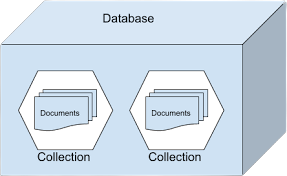

# Writing Test Week-7

# DAY 10 | Sequelize

## Generate Migration, Model, Seeding

- Sequelize init

    Pertama kita perlu melakukan inisialisasi di project kita terlebih dahulu agar dapat melakukan generate code

    `npx sequelize-cli init`

- Setting database

<b>Generate Model</b>

Akhirnya kita dapat menggunakan generate dan kita bisa mengecek ke database sehingga dapat kita gunakan untuk penimpanan DB

`npx sequelize-cli db:migrate`

Jika ada yang salah, kita bisa mengembalikan (undo) menggunakan :

`npx sequelize-cli db:migrate:undo`

Ketika kita berhasil melakukan generate maka kita dapat melihat di database ada 1 table baru yang bernama Todos dan ada table SequelizeMeta

<b>Generate Seed</b>

Seed adalah data awal yang bisa kita gunakan untuk mengisi data di database untuk keperluan awal project menggunakan sequelize

`npx sequelize-cli seed:generate -- name demo-todo`

Ketika sudah berhasil melakukan generate maka kita dapat melakukan pengisian data seed didalam file seed generator. Terdapat 2 data yang diisi yaitu “up” untuk mengisi data di db, dan “down” untuk drop atau menghapus semua data seed di db

## Membuat Basic CRUD Menggunakan Sequelize

Setelah Model tersedia, maka model tersebut bisa kita gunakan untuk membuat CRUD.

Beberapa endpoint RESTFul :


1. Get All Todos
2. Get Todo Detail By Id
3. Create New Todo
4. Update Todo By Id
5. Delete Todo


# DAY 11 | MongoDB

MongoDB adalah salah satu jenis database NoSQL yang cukup populer digunakan dalam pengembangan website. Berbeda dengan database jenis SQL yang menyimpan data menggunakan relasi tabel, MongoDB menggunakan dokumen dengan format JSON. 

## Perbedaan NO SQL & SQL

<table>
<tr>
<th>PERBEDAAN</th>
<th>NO SQL</th>
<th>SQL</th>
</tr>
<tr>
<td>Bahasa</td>
<td>Bahasa NoSQL tidak memiliki skema dan struktur. Data pada NoSQL juga dapat disimpan dengan berbagai cara seperti graph-based, document-oriented, column-oriented, dan key-value.</td>
<td>Bahasa SQL adalah bahasa query yang terstruktur, hal ini menyebabkan SQL agak terbatas.</td>
</tr>
<tr>
<td>Aplikasi</td>
<td> NoSQL, jenis database ini cocok untuk database yang membutuhkan kumpulan data besar, seperti big data. NoSQL juga banyak digunakan dalam aplikasi jejaring sosial atau manajemen pelanggan, dan struktur datanya dapat diubah kapan saja sesuai dengan perkembangan aplikasi itu sendiri.</td>
<td>SQL memiliki sifat table-based dan sangat cocok untuk aplikasi yang memerlukan transaksi multi baris.</td>
</tr>
<tr>
<td>Komunitasi</td>
<td> NoSQL juga memiliki perkembangan yang sangat cepat. Hadirnya stack seperti MEAN (MongoDB, Express JS, Angular JS, Node JS) atau MERN (MongoDB, Express JS, React JS, Node JS) membuktikan bahwa walaupun terbilang baru, NoSQL memiliki komunitas yang cukup dapat diandalkan.</td>
<td>SQL adalah komunitas yang lebih besar dibanding NoSQL. Penyebabnya adalah SQL telah ada sejak lama dan sudah berumur puluhan tahun.</td>
</tr>
<tr>
<td>Skabilitas</td>
<td> Database SQL diskalakan secara vertikal. Artinya, jika kita ingin memperluas database, yang bisa kita lakukan adalah meningkatkan kapasitas beban efektif server dengan mengupgrade komponennya (seperti RAM, kapasitas SSD, atau CPU).</td>
<td>Database SQL diskalakan secara vertikal. Artinya, jika kita ingin memperluas database, yang bisa kita lakukan adalah meningkatkan kapasitas beban efektif server dengan mengupgrade komponennya (seperti RAM, kapasitas SSD, atau CPU).</td>
</tr>
</table>

## Anatomi komponen dari Database MongoDB



`Database` adalah wadah untuk menyimpan berbagai macam Collection

`Collection` adalah tempat kumpulan dari berbagai macam document, sehingga collection sering disamakan dengan tabel pada SQL

`Document` adalah unit terkecil yang berada pada MongoDB

## Instalasi MongoDB

Untuk proses lengkap bisa kunjungi dokumentasi MongoDB.

https://docs.mongodb.com/manual/administration/install-community/

## Basic Penggunaan MongoDB

Untuk mempermudah kita bisa menggunakan GUI Tools Official dari MongoDB yaitu MongoDB Compass

Link untuk download MongoDB Compass

https://www.mongodb.com/products/compass


## Basic CRUD menggunakan MongoDB

- Kita bisa mulai dengan menyalakan MongoDB, lalu kita bisa mengakses dengan mengetikan `mongo` pada terminal

- Untuk melihat database yang aktif, bisa gunakan `db` pada MongoDB shell

- Untuk melihat daftar database bisa menggunakan `show dbs`

- Untuk masuk database baru gunakan `use ..`

> _ex : use music_

- Untuk menambahkan Collection baru kita bisa gunakan

`db.createCollections(“..”)`

> _ex : db.createCollections(“artis”)_

- Untuk menambahkan data pada Collection kita bisa gunakan

```
db.namaCollection.insert({
    
    data collection

})
```
_ex :_

```js 
db.artis.insert({
    nama: "Peterpan",
    genre: "pop"
})
```
- Untuk melihat data kita gunakan

`db.namaCollection.find()`

> _ex : db.artist.find()_

- Untuk mengupdate data pada Collection kita bisa gunakan

``` js
db.namaCollection.update({
'datasebelum'
},{
$set:{'datasesudah'}
})
```
_ex :_

```js
db.artis.update({
'nama':'Peterpan'
},{
$set:{'nama':'Noah'}
})
```

- Untuk menghapus data pada Collection kita bisa gunakan

```js
db.namaCollection.remove({
'datayangingindihapus'
})
```

_ex :_

```js
db.artis.remove({
'nama': ‘Noah’
})
```

# DAY 12 | Mongoose

Mongoose adalah library yang bisa dibilang sebagai Object Modelling MongoDB untuk NodeJS.

Mongoose bisa digunakan untuk mengelola hubungan antara data, menyediakan validasi.

## Instalasi Mongoose

- Buka terminal arahkan terminal ke directory project kita, lalu untuk Install MongoDB gunakan command berikut pada terminal

     `npm install mongoose`
    >Pastikan NodeJS dan MongoDB juga sudah terinstall.

    setelah menginstall mongoose dengan npm, directory project kita akan membuat sebuah folder baru bernama `node_module`, yang berisi folder mongoose.

## Create Connection

- Buat sebuah file javascript dalam project directory kita, dan beri nama server.js. Setelah itu buka file server.js pada editor kesukaan anda, lalu load module mongoose,
    
    `var mongoose = require('mongoose');`

    `mongoose.connect('mongodb://localhost/mongoose_basics');`

    Baris pertama termasuk pustaka mongoose. Kemudian, Saya membuka sebuah koneksi ke database yang saya sebut mongoose_basics menggunakan fungsi connect. Fungsi connect menerima dua pilihan parameter lainnya

## Populate

Populate ada kaitannya dengan relasi database. Populate adalah proses penggabungan 2 collection atau lebih menjadi satu objek JSON.


# DAY 13 | Docker

Docker adalah software yang menjalankan suatu aplikasi menggunakan container.

Docker men-sharing kernel dari host OS, serta meng-container-kan suatu aplikasi agar dapat dijalankan dimana saja dan kapan saja.

Docker berfungsi sebagai penyedia layanan virtual bagi aplikasi yg diinstall pada sebuah host.

## Pentingnya Docker

1. Mempermudah Pengembangan Aplikasi

    Docker bisa mempermudah pekerjaan developer ketika mengembangkan aplikasi. Alasannya, Docker lebih hemat resource dan mampu menyediakan environment yang stabil untuk dijalankan di perangkat apapun, mulai dari cloud server hingga komputer pribadi.

2. Menyederhanakan Konfigurasi

    Docker tidak memiliki overhead sehingga developer bisa menjalankan aplikasi yang diuji tanpa konfigurasi tambahan.

3. Memudahkan Pengembangan Kode Pipeline

    Developer bisa memanfaatkan Docker container sebagai tempat pengujian kode Pipeline beserta tools yang diperlukan dengan lebih mudah.

4. Bisa Digunakan untuk Debugging

    Adanya fitur debug bisa membantu developer untuk mengatasi masalah pada aplikasi tanpa perlu bersusah payah meninggalkan environment di Docker.

5. Mendukung Multitenancy

    Docker cocok digunakan untuk membuat aplikasi berstruktur multitenance seperti Software as a Service (SaaS). Anda bisa membuat lebih dari satu environment yang terisolasi dan menjalankan objek aplikasi untuk setiap tenant.

6. Meningkatkan Sumber Daya dengan Cepat

    Dengan Docker, peningkatan sumber daya perangkat dapat dilakukan dengan cepat sehingga durasi pengembangan software  lebih singkat.

## Istilah-Istilah dalam Docker

 Dalam penggunaan Docker, inilah beberapa istilah yang perlu Anda pahami:
 
- `Docker image`
    
    Kumpulan file yang menunjang sebuah aplikasi.

- `Docker container`
    
    Wadah untuk mengemas dan menjalankan aplikasi. Wadah ini mencakup kode, runtime, system tools, dan pengaturan. Container hanya bisa mengakses resource yang telah ditentukan dalam Docker image.

- `Docker client`
    
    Tempat di mana pengguna dapat mengirimkan perintah seperti Docker build, Docker pull, dan Docker run kepada Docker daemon.

- `Docker Engine Rest API`
    
    Komponen yang digunakan untuk berinteraksi dengan Docker daemon. Komponen ini bisa diakses klien melalui HTTP.

- `Docker daemon`
    
    Proses pengelolaan Docker images, container, network, dan storage volumes. Docker daemon menerima request dari Docker API dan akan memprosesnya.

- `Docker host`
    
    Komponen yang menyediakan lingkungan untuk menjalankan aplikasi. Docker host bertanggung jawab menerima perintah yang diberikan Docker client.

- `Docker registry`
    
    Wadah untuk menyimpan Docker image. Docker image akan memberi reaksi sesuai perintah yang diberikan. Misalnya, saat diberi perintah docker push, docker image akan didorong atau dibagikan ke registry Docker Hub.

- `Docker Hub`
    
    Layanan yang disediakan untuk menemukan dan berbagi Docker image.

## Basic Sntax Docker Terminal

- `docker ps` Menampilkan daftar Docker container
- `docker pull` Download image dari docker hub
- `docker images` Melihat kumpulan images yang sudah terdownload
- `docker run` Menjalankan container
- `docker stop` Menghentikan Docker
- `docker kill` Kill Docker
- `docker stats` Melihat status Docker
- `docker rm` Menghapus Docker

## Dockerfile

Merupakan sebuah blueprint untuk  membuat image, kamu juga bisa membuat custom image menggunakan docker file.

Caranya:

1. Buat file Dockerfile di dalam project yang kamu buat
2. Tulis beberapa perintah ke dalam dockerfile
3. Jalankan docker file menggunakan perintah

    `docker build -t NAMA_IMAGES:TAG .`
    
    `docker build -t my-app:1.0` 

## Docker Compose

Cara untuk menjalankan lebih dari 1 container secara bersamaan dan saling terhubung

Caranya:

1. Buat file `NAMA_FILE.yaml` di dalam project yang kamu buat
2. Tulis beberapa perintah ke dalam sana
Jalankan menggunakan perintah 
`docker-compose NAMA_FILE.yaml up`

